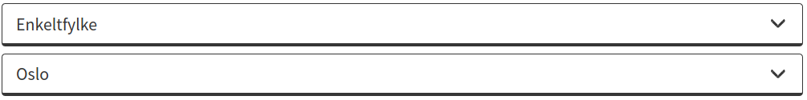
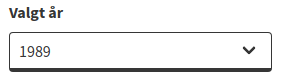
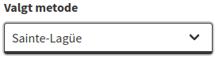
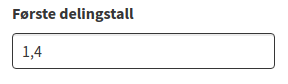
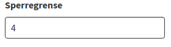
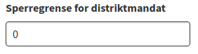
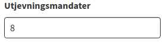
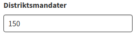
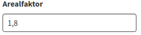
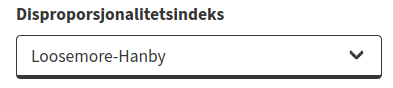

# Menu

## Tabeller

### Landsoversikt

Viser en fullstendig oversikt over partienes stemmeantall, prosent stemmeandel, samlede mandatgevinst (både distriktsmandater og utjevningsmandater), fordelt på de enkelte valgdistrikter (fylker).

Kolonnen helt til høyre, 'Prop.', viser avviket mellom de enkelte partienes andel av mandatene på Stortinget og deres andel av stemmene. For hvert parti utgjør dette med andre ord differansen mellom prosentandel av stemmene og prosentandelen av mandatene.

### Fylker

Viser en oversikt over fylkenes antall stemmer, mandatgevinst (både distriktsmandater og utjevningsmandater) og antall stemmer per mandat.

### Utjevningsmandater

Viser en oversikt over fra hvilket fylke hvert parti har fått utjevningsmandater fra.

### Restkvotienter

Viser en radvis liste over [restkvotienter](./forklaringer.md#justert-restkvotient).

Hver rad representerer restkvotientene til ett fylke. Markerte celler indikerer hvilket partiet som har vunnet utjevningsmandat i fylke.

**Restkvotienter representert i Lavinia**  
For å utjevne de store forskjellene mellom fylkene så er partienes restkvotienter justert ved å dividere restkvotientene på det gjennomsnittlige antall stemmer som står bak hvert mandat i vedkommende fylke.

### Fylkesfordeling av mandater

<!--  -->

Viser fylkenes fordeling av mandater på alle partier.

### Enkeltfylke  

Viser en fullstendig oversikt, for valgt fylke, over partienes andel stemmer, mandatgevinst, margin (i antall stemmer) og sistekvotient.

**[Margin til sistemandatet](./forklaringer.md#margin-til-sistemandatet)**

## Menyer

### Valgt år

Her kan du se på Stortingsvalg fra 1945 og fram til 2017.

Ved å se på ulike valgår kan du se utviklingen av den norske valgordningen for stortingsvalg fram til i dag.

### Valgt metode

Her kan du velge å fordele mandatene med enten Sainte-Laguës eller d'Hondts metode.

Dette er beregningsmetoder som blir brukt når distriktsmandatene skal fordeles på partiene i distriktene og deretter når utjevningsmandatene skal fordeles på partiene på landsbasis (sistnevnte kun for partier over sperregrensen). Både Sainte-Laguës og d'Holts metode er proporsjonale valgordninger hvor kandidater velges i forhold til antall stemmer de eller deres valgliste får.

Se [beregningsmetoder](./forklaringer.md#beregningsmetoder)

### Første delingstall

Her kan du forandre det første delingstallet i [Sainte-Laguës metode](./forklaringer.md#beregningsmetoder). Dette er det tallet som hvert partis stemmetall deles på før tildelingen av mandater begynner. Hensikten er at dette skal gi et visst «styringstillegg» til de store partiene og hindre politisk fragmentering. Ved å gjøre det første delingstallet større blir det vanskeligere å få det første mandatet. Dermed blir det også vanskeligere for de partiene som kan bare få ett mandat å få det ene mandatet.

Eksempel: Gå til landsoversikt-tabellen og se hvor mange mandater de enkelte partiene får hvis du varierer det første delingstallet fra 1,0 til 2,0. Merk at ved valget i 2017 ville Miljøpartiet De Grønne fått ett mandat ekstra hvis delingstallet hadde vært 1,2. Senterpartiet ville da mistet ett mandat. Med et delingstall på 1,0 ville MDG fått to mandater ekstra, men da på bekostning av Kristelig Folkeparti og Høyre.

Dagens valgordning har 1,4 som første delingstall.

### Sperregrense

Her kan du variere sperregrensen.

For å være med i konkurransen om utjevningsmandater må partiene komme over en sperregrense i oppslutning i landet sett under ett (prosent av stemmene på landsbasis). Denne sperregrensen gjør at fordelingen av utjevningsmandater kan få store utslag. Den kan hindre små partier i å få stor innflytelse, siden små partier får færre mandater enn stemmeantallet deres skulle tilsi uten sperregrensen. De som kommer akkurat over sperregrensen derimot, kan få mange flere mandater enn de ellers ville ha fått.

Eksempel: Partier som kommer over sperregrensen kan bli representert uten at de har vunnet noen distriktsmandater. Hvis f.eks. sperregrensen hadde vært 3 prosent i 1989, ville Venstre blitt representert med 5 utjevningsmandater.

### Sperregrense for distriktsmandat

Her kan du se hvilke utslag en sperregrense for fordeling av distriktsmandatene ville fått.

Denne sperregrensen skal gjelde i det enkelte valgdistrikt, dvs. ved beregningen av distriktsmandater. I den gjeldende valgordning er det ingen slik formell sperregrense på distriktsnivå.

### Utjevningsmandater

Her kan du justere antall utjevningsmandater.

I dag så består Stortinget av i alt 169 representanter der 19 mandater fordeles som utjevningsmandater.

Hensikten med utjevningsmandater er å utjevne skjevheter som er oppstått etter fordelingen i fylkene. Utjevningsmandatene går til de partiene som har kommet dårligere ut av distriktsfordelingen enn deres stemmeandel skulle tilsi.

Fordelingen av utjevningsmandater skjer etter fordelingen av distriktsmandater. Det er nemlig partienes samlede stemmetall for landet som helhet (landsbasis) som er utslagsgivende for fordelingen av utjevningsmandatene. Partier som har under 4,0 prosent av stemmene på landsbasis ikke er med i konkurransen om utjevningsmandatene. Men dette kan endres ved å sette sperregrensen lavere enn 4,0.

### Distriktsmandater

Her kan du endre antall distriktsmandater.

Stortinget består av i alt 169 representanter der 150 mandater fordeles distriktsvis.

I dag brukes Sainte Laguës modifiserte metode (første delingstall 1.8) til å fordele distriktsmandatene etter partienes stemmetall i de enkelte valgdistrikter.

Se [stortingsvalg med Sainte Laguës metode](./forklaringer.md#stortingsvalg-med-sainte-lagues-metode)

Merk at før stortingsvalget så er det regnet ut hvor mange distriktsmandater hvert enkelt valgdistrikt (fylke) skal ha. Se [Geografisk fordeling av mandater](./forklaringer.md#geografisk-fordeling-av-mandater).

### Arealfaktor

Her kan du endre arealfaktor. Dagens ordnings har en arealfaktor på 1.8.

Arealfaktor er tallet som multipliseres med antall kvadratkilometer i fylke før det legges til summen av antall innbyggere i fylket. Jo høyere arealfaktor, jo større vekt tillegges fylkets geografiske utstrekning. Hvis arealfaktoren settes til null, vil fordelingen bare ta hensyn til innbyggertallet i fylket og gi en fylkesfordeling av mandatene som er proporsjonal med folketallet.

Se [Geografisk fordeling av mandater](./forklaringer.md#geografisk-fordeling-av-mandater).

Se [Tabell over geografisk fordeling](./forklaringer.md#tabell-over-geografisk-fordeling)

Se [Utregning med arealfaktor](./forklaringer.md#utregning-med-arealfaktor).

### Disproporsjonalitetsindeks

Velg enten Loosemore-Hanbys eller Gallaghers

Det finnes mange ulike måter å gi uttrykk for i hvor stor grad en valgordning avviker fra matematisk "rettferdighet", det vil si at partienes andel av mandater er lik deres andel av stemmene. Vi skal kort beskrive to ulike mål eller "indekser".

Loosemore-Hanbys indeks (L-H)
Denne indeksen beregnes ved å summere prosentdifferansene mellom partienes andel av mandatene og deres andel av stemmene. Dernest deler man på 2 (Vanligvis brukes 'D' som forkortelse av denne indeksen. I Lanvinia brukes imidlertid 'L-H' som er mer direkte forståelig).

Matematisk ser formelen slik ut:

hvor  uttrykker partienes andel av stemmene (votes) og  uttrykker deres andel av mandatene (seats)

Denne indeksen gir et enkelt mål på hvor mange prosentpoengs avvik det er for de partiene som er overrepresentert (henholdsvis underrepresentert) i forhold til den aktuelle valgordning. Fordelen med indeksen er at den er enkelt å forstå og tolke. Indeksen uttrykker avviket fra fullstendig proporsjonalitet i prosentpoeng, og jo høyere indeksverdi, jo mindre proporsjonal er valgordningen. Svakheten med Loosemore-Hanbys indeks er imidlertid at den overdriver disproporsjonaliteten i systemer med mange partier. I Lavinia er det Loosemore-Hanbys indeks som vises når programmet starter opp første gang. I resultatvinduet står det da f.eks. "L-H:5,4". Det er imidlertid mulig å endre dette til Gallaghers indeks (se under).

Gallaghers indeks (LSq)
Et tredje mål på disproporsjonalitet er Gallaghers minste kvadraters indeks (ofte benevnt 'LSq'). Denne indeksen er den mest vanlige når man ønsker å måle avvik fra matematisk rettferdighet. Det er også mulig å få Lavinia til å beregne denne indeksen i stedet for Loosemore-Hanbys. Gallaghers indeks beregnes ved å ta kvadratroten av følgende uttrykk: de summerte kvadrerte avvikene mellom hvert partis andel av stemmene og dets andel av mandatene dividert på 2.

Matematisk ser formelen slik ut:

hvor  uttrykker partienes andel av stemmene (votes), mens  uttrykker deres andel av mandatene (seats)

Denne indeksen lar med andre ord de store avvikene telle mer enn de små. I prinsippet kan Gallaghers indeks variere mellom 0 og 100, men i praksis viser det seg at de fleste indeksverdier ligger mellom 1 og 10. I størrelse ligger Gallaghers indeks mellom Loosemore-Hanbys (høyest) og Raes (lavest). De forskjellige måtene å måle disproporsjonalitet på er imidlertid sterkt korrelert. Dessuten er graden av disproporsjonalitet ikke nødvendigvis den viktigste egenskap ved en valgordning. De politiske utslagene kan være langt viktigere. I faglitteraturen blir det påpekt at man i tillegg til en valgordnings samlede avvik fra fullstendig proporsjonalitet, bør se om ordningen diskriminerer mellom store og små partier, eller om disse behandles likt.
